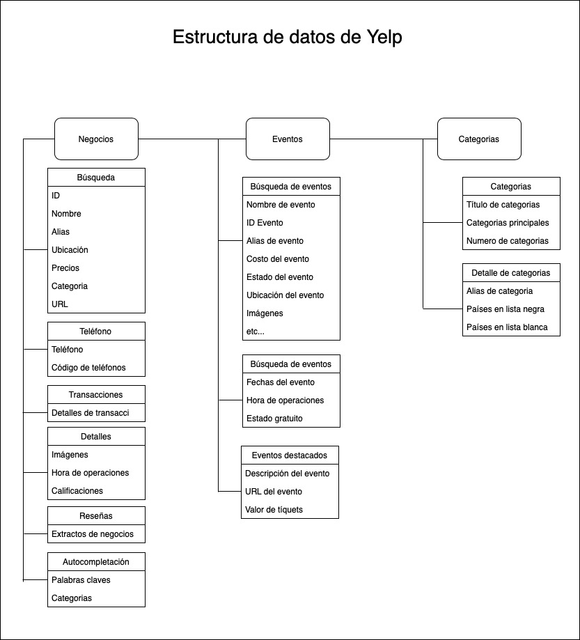

<h3 align="center">Procesamiento de datos plaforma YELP</h3>

<details open="open">
  <summary>Tabla de contenidos</summary>
  <ol>
    <li> <a href="#sobre">Sobre el proyecto</a></li>
    <li><a href="#requerimientos">Requerimientos</a></li>
    <li><a href="#construido">Construido con</a></li>
    <li><a href="#api_consultado">YELP API Consultado</a></li>
    <li><a href="#folders">Folders</a></li>
    <li><a href="#nomenclatura">Nomenclatura</a></li>
    <li><a href="#empezando">Empezando</a></li>
    <li><a href="#contact">Contact</a></li>
    <li><a href="#acknowledgements">Acknowledgements</a></li>
  </ol>
</details>


<div id="sobre"></div>

## Sobre el proyecto
El proyecto es un software que pueda extraer, transformar y cargar los datos de los negocios de la plataforma YELP.

<div id="requerimientos"></div>

## Requerimientos: 

<ol>
<li>En primer lugar, descubrir cómo YELP presenta los datos delos negociosy modelar esta estructura de datos para que sepamos cómo interactuar con ella. YELP parece tener el concepto de business, event, category, etc. y debemos descubrir y documentar estos esquemas y relaciones de datos. (Pueden usar esquemas, diagramas, según se considere necesario)</li>
<br/>
<li>En segundo lugar, debemos desarrollar una forma de extraer la información de YELP de los restaurantes de la cuidad de Asheville.</li>
<br/>
<li>Posteriormente se debe extraer los datos del restaurante por el ID del restaurante. </li>
<br/>

<li>Se debe procesar los datos para que sea almacenada en una tabla donde se muestrela información del restaurante. </li>
<br/>

<li>Los datos extraídos deben ser en formato jsony deben ser subidos a un repositorio en Github al igual que la documentación que se debe generar del punto 1.</li>
</ol>


<div id="construido"></div>

## Construido con:
En esta seccion se especifica las herramientas tecnicas con las que se realizo el proyecto

* [Python](https://www.python.org/)
* [Jupyter](https://jupyter.org/)
* [COLAB](https://colab.research.google.com/notebooks/intro.ipynb#recent=true)

<div id="api_consultado"></div>

### API Consultado:
En este proyecto se utilizo el API de la plataforma [YELP](https://www.yelp.com/developers/documentation/v3), esta plataforma ofrece una serie de endpoints para consultar datos estructurados en JSON. 

Dejo los links de la documentacion abajo

* [BUSCAR](https://www.yelp.com/developers/documentation/v3/business_search)

* [BUSCAR POR_ID](https://www.yelp.com/developers/documentation/v3/business)

Los datos de los endpoints de arriba son extraidos en forma JSON, y tienen la siguiente estructura:

<a href="https://github.com/othneildrew/Best-README-Template">
   
</a>
</ol>


<div id="folders"></div>

## Estructura de los Folders:

Nuestro proyecto tiene la siguiente estructura de folders:

```
|-- Python_Yelp_Request_Data_Cleaning
|   |-- APP
|   |   |--Python_Yelp_Request_Data_Cleaning.ipynb
|   |   |--token.txt
|   |-- Datos_Procesados_CSV
|   |   |--Restaurantes.csv
|   |   |--Restaurante Corner Kitchen.csv
|   |-- Datos_Sin_Procesar_JSON
|   |   |-- restaurante 3nu2FbuN__5LqOaGDRihTQ.json
|   |   |-- Restaurantes.json
|   |-- Esquema_API
|   |-- README.md
```

<div id="nomenclatura"></div>

## Nomenclatura:

La nomenclatura utilizada para los folders es [SNAKE_CASE](https://en.wikipedia.org/wiki/Snake_case)
La nomenclatura utilizada para los files es [Pascal CASE](https://www.theserverside.com/definition/Pascal-case)


<div id="Empezando"></div>

<!-- GETTING STARTED -->
## Empezando

El proyecto en realidad corre sobre un `Jupyter notebook` en un `Google Colab`, preferiblemente se debe de correr en esa plataforma. sin embargo tambien se puede correr desde un ambiente local utilizando `ANACONDA`. 

Adjunto una guia abajo para la instalacion de `ANACONDA`

### PyPI

```shell
python setup.py install
```

### Anaconda

```shell
conda build --python {PYTHON_VERSION} meta.yaml
```

### Uploading your package

### PyPI

```shell
# ensure `twine` is install
pip install twine
# package source code
python setup.py sdist
twine upload dist/*
```

### Anaconda

```shell
# ensure conda-build and anaconda-client are installed
conda install conda-build anaconda-client
# build package for a specific python version
conda build --python {PYTHON_VERSION} meta.yaml
# upload to Anaconda Cloud
cd $HOME/miniconda3/conda-bld/
anaconda upload */PACKAGENAME-VERSION_*.tar.bz2
```

### PyPI

```shell
pip install PACKAGENAME
```

### Anaconda

```shell
conda install PACKAGENAME
```

### Instalación

1. Abrir ANACONDA o COLAB
2. Clonar el REPO
   ```sh
   git clone https://github.com/your_username_/Project-Name.git
   ```
3. Abrir el Jupyter Notebook  y abrir el archivo: ```APP/Python_Yelp_Request_Data_Cleaning.ipynb```

4. Crear un Token API Key ```APP/token.txt```


<!-- USAGE EXAMPLES -->
## Uso

Unicamente se necesita poner a correr las celdas de los Scripts y eso va a generar archivos CSV 


<!-- CONTRIBUTING -->
## Contruibuir

Las contribuciones son lo que hacen que la comunidad de código abierto sea un lugar tan increíble para aprender, inspirar y crear. Cualquier contribución que haga es **muy apreciada**.

1. Clone el proyecto
2. Cree un branch con la siguiente estructura: (`git checkout -b feature/AmazingFeature`)
3. Haga comentarios de sus cambios (`git commit -m 'Add some AmazingFeature'`)
4. Haga push del branch (`git push origin feature/AmazingFeature`)
5. Abra un Pull Request


<!-- CONTACT -->
## Contacto

William Aguilar - [@Github](https://github.com/william2215) - wil-19-60@live.com

Project Link: [https://github.com/william2215/Python_Yelp_Request_Data_Cleaning/](https://github.com/william2215/Python_Yelp_Request_Data_Cleaning/)


